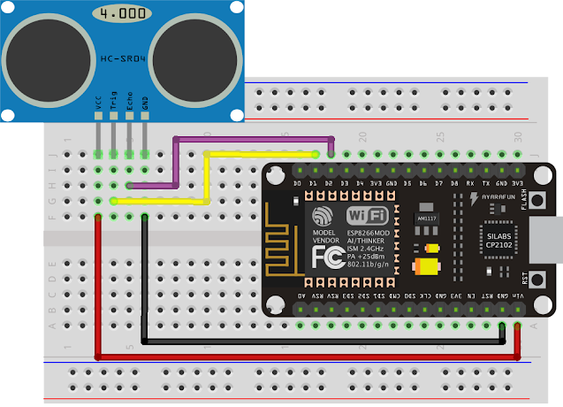

# Arduino Ultrasonic Sensor Simple
    
Sensor module to measure the distance 2cm to 400 cm


## Equipment used

* Ultrasonic HC-SR04
* NodeMCU  v2.0
* Breadboad
* Jumper wire

### Complete the circuit assembly as shown below.


### Basic code ultrasonic HC-SR04
```c++
#define TRIGGER_PIN  5
#define ECHO_PIN     4

void setup() {
  pinMode(TRIGGER_PIN, OUTPUT);
  pinMode(ECHO_PIN, INPUT);
  pinMode(BUILTIN_LED, OUTPUT);

  Serial.begin (9600);
}

void loop() {
  long duration, distance;

  digitalWrite(TRIGGER_PIN, LOW);
  delayMicroseconds(2);
  digitalWrite(TRIGGER_PIN, HIGH);
  delayMicroseconds(10);
  digitalWrite(TRIGGER_PIN, LOW);

  duration = pulseIn(ECHO_PIN, HIGH);
  distance =  duration * 0.034 / 2;

  Serial.print(distance);
  Serial.println(" cm");
  delay(1000);
}
```
